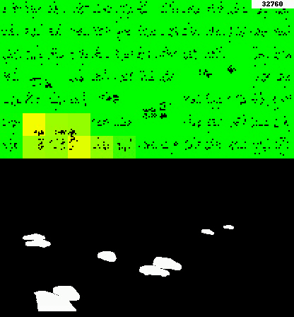

# Grid HTM


This repo depends on htm.core (https://github.com/htm-community/htm.core)
### Cloning and Setup
To clone the repo and htm.core:
```commandline
git clone https://github.com/vladim0105/GridHTM
git submodule update --init --recursive
```
To build and install htm.core, which requires cmake and more (see https://github.com/htm-community/htm.core):

(default)
```commandline
cd htm.core/
python setup.py install --user --force
```
(Anaconda)
```commandline
cd htm.core/
python setup.py install
```
### Running
To run:
```commandline
python main.py segmentedVideoFile settingsFile -o outputName
```
Where `segmentedVideoFile` is the path to a segmented video file (unless code is modified, it can only contain one class of objects) and
`settingsFile` is the path to a settings json file, see `surveillance_experiment_params.json` for an example.
`outputName` is the name of the resulting output files that are generated.


Help:
```commandline
python main.py -h
```